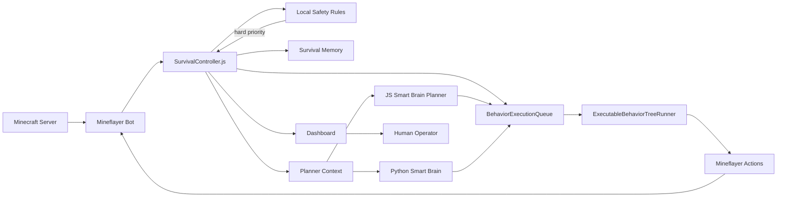
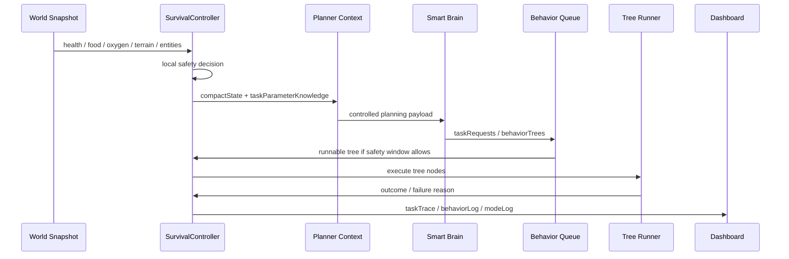
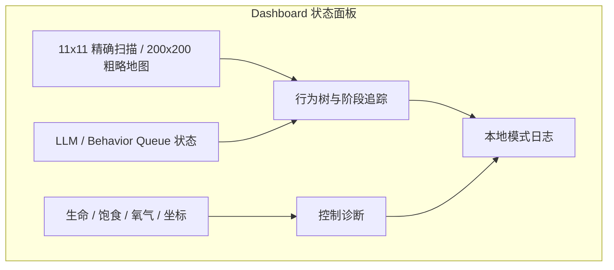
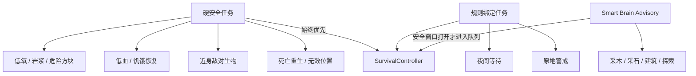
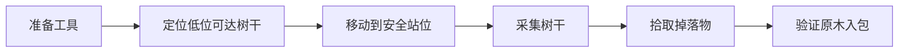

jijingcraft 是一个 Minecraft 陪伴智能体项目。它不是脚本刷物品，也不是作弊指令演示，而是让 BOT 在普通生存规则下持续观察世界、理解风险、选择任务、执行行为树，并通过 Dashboard 把每一次决策、失败和恢复过程展示出来。


让 Minecraft 生存 BOT 从“执行脚本”进化为“可观察、可恢复、可扩展的 Smart Brain 智能体”。

## 02. 产品亮点

| 亮点                 | 展示价值                                                     | 商业表达                           |
| -------------------- | ------------------------------------------------------------ | ---------------------------------- |
| 本地安全优先级       | LLM 不能覆盖低血、危险方块、低氧、敌对生物、夜间安全等硬规则 | 可控 AI，而不是不可预测自动化      |
| Smart Brain 任务实例 | LLM 输出 `taskRequests` / `behaviorTrees`，不输出自由文本动作 | 规划层和执行层清晰分离             |
| 行为树队列           | 任务以准备、感知、移动、执行、验证的节点运行                 | 可审计、可回放、可测试             |
| Dashboard 可观测性   | 页面显示状态、行为树、队列、阶段追踪、诊断、modeLog          | 演示友好，适合商业展示和现场排障   |
| 失败反馈与恢复       | 不可达目标、stale trace、无效坐标、死亡重生会触发恢复        | BOT 不只是尝试，还会学习避开坏策略 |
| 研究项目融合         | 吸收 Mindcraft、Malmo、Minecraft_AI 等思路，但控制权保持本地 | 兼具工程落地和研究扩展性           |

## 03. 当前能力范围

项目已覆盖早期生存循环的关键动作：

- 环境危险识别与逃离：岩浆、仙人掌、甜浆果伤害、水下低氧、冰下破冰呼吸。
- 地形脱困：坑洞逃离、高台水坑下降、平台出生优先下降。
- 生存基础：吃食物、觅食、采木、制作基础物资、采石、工具升级。
- 夜间策略：临时庇护、等待天亮、敌对生物撤离/防御。
- 建筑进度：地表固定庇护所、门洞、基础功能方块状态追踪。
- 规划扩展：JS Planner 与 Python Smart Brain 都可消费同一套 compact planner context。
- 可观测控制：Dashboard 显示任务树、队列、诊断、行为日志、本地模式日志。

## 04. 系统架构图



**架构说明**

核心控制权始终在 `SurvivalController.js`。Smart Brain 只提供高层任务实例，例如 `CollectWoodTree({ count: 4 })`，不能直接调用 Mineflayer API，也不能绕过本地安全规则。行为树队列负责保存 pending/current/completed 状态，Dashboard 负责把运行过程变成可读、可展示、可排障的产品界面。

## 05. Smart Brain 如何工作



**关键区别**

传统自动化常见问题是“模型想做什么就让它做什么”。本项目的策略相反：模型只负责给出受控任务参数，真正的动作执行、优先级、安全中断、失败恢复全部在本地控制器完成。

## 06. Planner Context 展示

Smart Brain 接收到的上下文不是完整世界转储，而是压缩后的关键状态：

```json
{
  "compactState": {
    "gameplay": {
      "health": 20,
      "hunger": 16,
      "oxygen": 20,
      "timeLabel": "morning",
      "isNight": false
    },
    "action": {
      "current": "collect_wood",
      "isIdle": false,
      "activePhase": "search"
    },
    "surroundings": {
      "below": "grass_block",
      "legs": "air",
      "head": "air",
      "safeStandCount": 80
    },
    "modes": {
      "safetyRule": "collect_wood",
      "queueActive": true,
      "recentModeLog": []
    }
  },
  "taskParameterKnowledge": {
    "commandMappings": ["!collectBlocks -> collect_wood / collect_stone"],
    "primitivePatterns": ["goToGoal", "collectBlock", "placeBlock"]
  }
}
```

这套设计思想做了工程约束：上下文只告诉 Smart Brain “可以实例化什么任务、可以传什么参数”，不提供任意执行代码能力。

## 07. Dashboard



Dashboard 不只是监控面板，也是商业演示的核心界面。它能把复杂的智能体行为拆成可被客户理解的链路：当前看到了什么、为什么选择这个任务、执行到了哪一步、失败后怎么恢复、哪个安全规则接管了控制权。


## 08. 本地安全优先级



商业价值在于“可控”。客户看到的不只是一个会动的 BOT，而是一个带有明确安全边界、审计日志和失败恢复机制的智能体运行时。

## 09. 行为树实例示例

```json
{
  "taskType": "collect_wood",
  "treeClass": "CollectWoodTree",
  "taskFunction": "collectWood",
  "constructorArgs": {
    "count": 4,
    "targetPosition": { "x": 12, "y": 64, "z": -3 },
    "searchRadius": 64,
    "tool": "auto"
  },
  "preconditions": ["not_in_hazard", "not_critically_hungry"],
  "postconditions": ["wood_inventory_increased"]
}
```

对应执行阶段：



